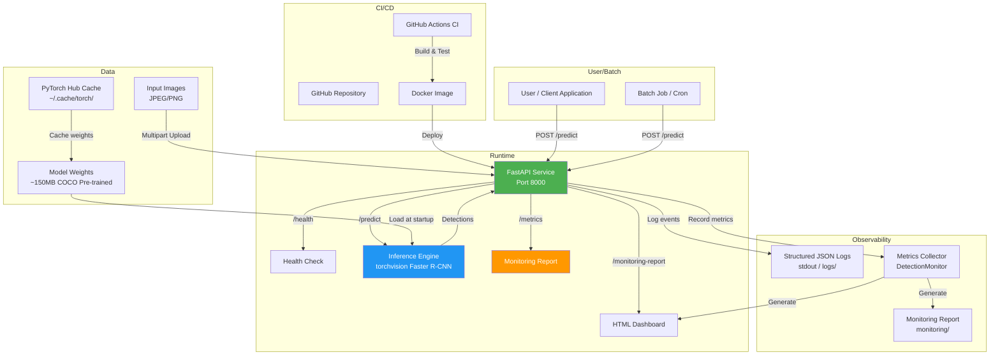

# Architecture Diagram

## System Architecture

## Component Description

| Component | Technology | Purpose |
|-----------|-----------|---------|
| Client | cURL / Python requests | Sends images for detection |
| FastAPI Service | Python 3.11, FastAPI 0.109 | HTTP API with health, predict, metrics endpoints |
| Object Detector | torchvision Faster R-CNN | Runs inference on CPU |
| Model Weights | COCO pre-trained | 80-class object detection |
| Monitoring | Custom DetectionMonitor | Collects latency, confidence, count metrics |
| Logs | JSON Lines via stdout | Structured operational logging |
| CI/CD | GitHub Actions | Build, test, lint, container smoke test |
| Packaging | Docker | Reproducible container handoff |

## Data Flow

1. **Upload:** Client sends `multipart/form-data` POST to `/predict`
2. **Validation:** Service checks content-type and file size (<10MB)
3. **Inference:** Image converted to tensor, passed to model
4. **Filtering:** Detections filtered by confidence threshold (0.5)
5. **Response:** JSON with bounding boxes, classes, scores, latency
6. **Logging:** Structured JSON log emitted with request metadata
7. **Monitoring:** Metrics recorded in-memory for report generation

## Deployment Target

- **Primary:** Local Docker container (fallback path)
- **Alternative:** GitHub Codespaces for review
- **Future:** Azure Container Apps (if student credit becomes available)

## What Would Change for Azure

1. **Container Registry:** Push image to Azure Container Registry (ACR)
2. **Compute:** Deploy to Azure Container Apps instead of local Docker
3. **Monitoring:** Replace file-based monitoring with Azure Monitor / Application Insights
4. **Logs:** Send structured logs to Azure Log Analytics
5. **Secrets:** Use Azure Key Vault for any future API keys
6. **Scaling:** Configure ACA auto-scaling rules based on CPU/memory
7. **CI/CD:** Add Azure login and deployment steps to GitHub Actions
